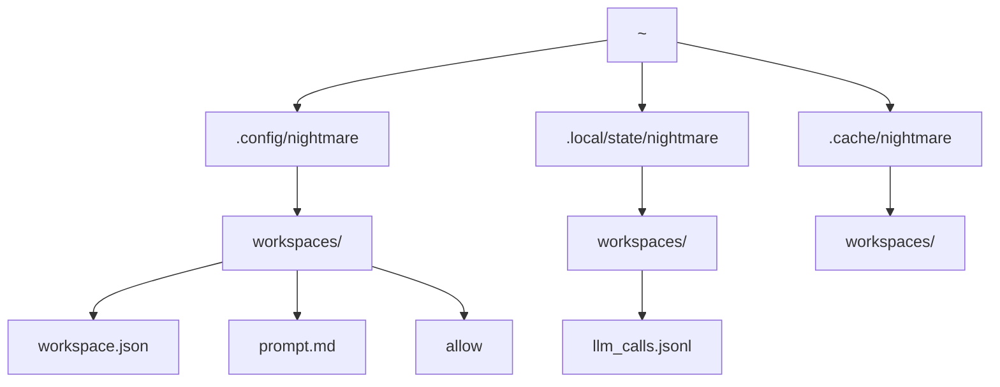

# Workspace and Storage

NIGHTMARE resolves the current working directory to its absolute real path to derive a unique workspace identity. This ensures deterministic tool execution and state tracking across sessions.

## Workspace Anchoring

NIGHTMARE establishes a workspace root strictly via realpath resolution. Symlinks are resolved to prevent duplicate workspace identities for the same physical directory.

```crystal
@root = File.realpath(root_path)
```

## Workspace ID Format

The workspace ID combines a sanitized directory slug with a SHA256 hash prefix of the absolute path. This prevents namespace collisions between identically named directories in different locations.

```crystal
raw_slug = File.basename(@root).gsub(/[^a-zA-Z0-9_-]/, "_")
slug = (raw_slug.empty? || raw_slug == "/" || raw_slug == "_") ? "root" : raw_slug

hash = Digest::SHA256.hexdigest(@root)[0..7]
@workspace_id = "#{slug}-#{hash}"
```

## Zero Repository Litter Guarantee

NIGHTMARE writes zero state, configuration, or log files to the target project directory. All operational data is strictly isolated within standard XDG base directories.

## XDG Directory Layout

NIGHTMARE organizes global and workspace-specific files according to the XDG Base Directory Specification. 



### Filesystem Layout

| Scope | Path | Purpose |
| ----- | ---- | ------- |
| Global Config | `$XDG_CONFIG_HOME/nightmare` | Default fallback for settings and global prompt overrides. |
| Workspace Config | `$XDG_CONFIG_HOME/nightmare/workspaces/<id>` | Manifest, workspace-specific prompts, and tool allowlists. |
| Workspace State | `$XDG_STATE_HOME/nightmare/workspaces/<id>` | Execution logs, audit trails, and `llm_calls.jsonl`. |
| Workspace Cache | `$XDG_CACHE_HOME/nightmare/workspaces/<id>` | Ephemeral data, indexing artifacts, and runtime cache. |

### Environment Variables

| Variable | Default Fallback |
| -------- | ---------------- |
| `XDG_CONFIG_HOME` | `~/.config` |
| `XDG_STATE_HOME` | `~/.local/state` |
| `XDG_CACHE_HOME` | `~/.cache` |

## The Workspace Manifest

The manifest tracks the canonical location and access lifecycle of a workspace. It resides at `workspace.json` within the workspace config directory.

```json
{
  "id": "nightmare-8a2b4c1d",
  "canonical_path": "/home/cam/repos/adjutant/nightmare",
  "created_at": "2026-09-17T08:00:00Z",
  "last_accessed": "2026-09-17T08:24:32Z"
}
```

### Manifest Fields

| Field | Type | Description |
| ----- | ---- | ----------- |
| `id` | String | The generated `<slug>-<hash>` identifier. |
| `canonical_path` | String | The resolved absolute path to the project root. |
| `created_at` | Time | UTC timestamp truncated to the second of initial creation. |
| `last_accessed` | Time | UTC timestamp updated on environment initialization. |

---
* Previous: [Quickstart](01-quickstart.md)
* Next: [Configuration](03-configuration.md)
