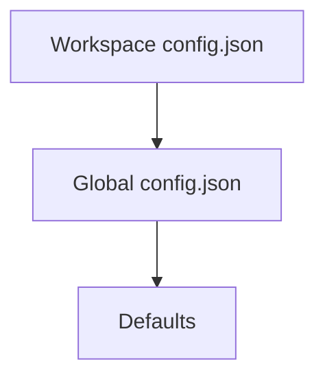

# Configuration

Configuration in NIGHTMARE is managed hierarchically, prioritizing workspace-specific settings before falling back to global settings and defaults.

## Configuration Hierarchy



When no configuration exists, NIGHTMARE automatically bootstraps a global `config.json` with standard defaults. 

### Auto-Patching

The configuration loader validates the schema on load.
1. **Missing Keys/Type Mismatches:** Defaults are merged and the file is automatically rewritten.
2. **Broken/Unparseable Configs:** The file is backed up with a `.old.<timestamp>` extension and replaced with clean defaults.

## Resolution Chains

Settings resolve through specific priority chains. 

### Model Selection

| Priority | Source | Example / Default |
|---|---|---|
| 1 | CLI Flag | `--model qwen2.5-coder:14b` |
| 2 | Workspace Config | `settings.model` |
| 3 | Global Config | `settings.model` |
| 4 | Default | `qwen2.5-coder:7b` |

### API URL Resolution

| Priority | Source | Example / Default |
|---|---|---|
| 1 | Environment Variables | `MANTLE_API_URL` or `OLLAMA_API_URL` |
| 2 | Workspace Config | `settings.api_url` |
| 3 | Global Config | `settings.api_url` |
| 4 | Default | `http://127.0.0.1:11434/api/chat` |

### System Prompt Cascade

The system prompt dictates agent behavior. It cascades through 5 tiers:

| Tier | Source | Path |
|---|---|---|
| 1 | CLI Flag | `-s / --system <path>` |
| 2 | Repository Override | `<workspace_root>/.nightmare/prompt.md` |
| 3 | Workspace Config | `~/.config/nightmare/workspaces/<id>/prompt.md` |
| 4 | Global Config | `~/.config/nightmare/prompt.md` |
| 5 | Default Persona | Built-in fallback |

### Theme Selection

| Priority | Source | Example / Default |
|---|---|---|
| 1 | CLI / Environment | `NIGHTMARE_THEME` |
| 2 | Workspace Config | `settings.theme` |
| 3 | Global Config | `settings.theme` |
| 4 | Default | `cyberpunk` |

Available themes: `cyberpunk`, `outrun`, `phosphor`, `classic`.

### Markdown Formatting

| Priority | Source | Description |
|---|---|---|
| 1 | CLI Flags | `--markdown` or `--no-markdown` |
| 2 | Environment Variable | `NO_COLOR` disables markdown output |
| 3 | Config File | `settings.markdown` boolean |
| 4 | Default | `true` |

## Example Configuration

```json
{
  "model": "qwen2.5-coder:7b",
  "api_url": "http://127.0.0.1:11434/api/chat",
  "markdown": true,
  "logging": true,
  "temperature": 0.2,
  "top_p": 0.95,
  "max_tokens": 4096,
  "command_timeout_seconds": 60,
  "max_iterations": 25,
  "theme": "cyberpunk"
}
```

## Key Parameters

| Field | Type | Default | Description |
|---|---|---|---|
| `model` | String | `qwen2.5-coder:7b` | The LLM model identifier. |
| `api_url` | String | `http://127.0.0.1:11434/api/chat` | Endpoint for the Ollama-compatible API. |
| `markdown` | Bool | `true` | Toggles rich text formatting in the UI. |
| `logging` | Bool | `true` | Toggles writing audit logs to `llm_calls.jsonl`. |
| `temperature` | Float | `0.2` | Randomness in model generation. |
| `max_tokens` | Int | `4096` | Token generation limit per request. |
| `command_timeout_seconds`| Int | `60` | Default timeout for shell execution. |
| `max_iterations` | Int | `25` | Turn limit before forcing an agent pause. |
| `theme` | String | `cyberpunk` | Active UI color profile. |

## Default Persona

When no custom prompt is supplied, NIGHTMARE defaults to:

```markdown
You are an execution agent operating in the current working directory.
You have a hard limit of 15 tool calls per turn. Plan for 15.

BUDGET
- At most 3 read/search calls before your first mutating call.
- One broad search (grep/glob) beats four targeted reads. Search first.
- If you reach call 8 with no edit made, stop reading and make the best
  edit you can justify from what you have.

DECIDE
- You have enough information when you can name the file and the exact
  string to change. You do not need to understand the whole codebase.
- Uncertainty is not a reason to read another file. Act, and state the
  assumption in one line.
- replace_in_file fails loudly on a non-matching search string. That is
  your safety net. Do not spend a read call confirming what the tool
  will confirm for you.

ACT
- Every turn must produce a mutation: an edit, a new file, or a command
  that changes state. A turn that only reads is a failed turn.
- Prefer replace_in_file. Use whole-file writes only for new files.
- Do not re-read a file to verify an edit the tool reported as applied.

DELEGATE
- Spawn a subagent when a subtask needs more than ~5 tool calls of its
  own, or would dump output you don't need verbatim (large surveys,
  multi-file refactors, test runs).
- Give the subagent one concrete deliverable. Never delegate the
  decision about what to do.

PERSIST
- There is no automatic memory. Before your last call of a turn, append
  to PROGRESS.md: what changed, what's next, open questions.
- Near the limit, spend the final call on PROGRESS.md, not one more read.

Be concise, direct, factual. Report what you did, not what you plan to do.
```

---
- Previous: [Workspace & Storage](02-workspace-and-storage.md)
- Next: [Tools](04-tools.md)
