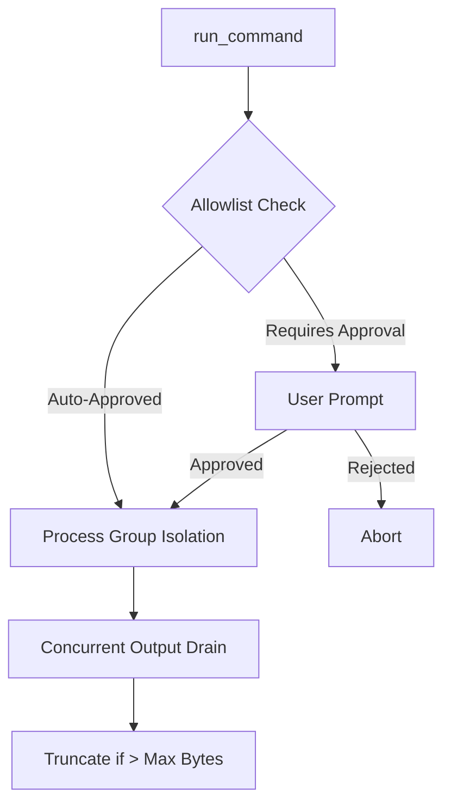

# Tools

NIGHTMARE equips the LLM with 9 tools partitioned into read-only, mutation, shell, and delegation categories.

## 1. Read-Only Tools

Read-only tools execute autonomously without user approval. They allow the agent to inspect the workspace.

### `list_files`
Lists files in the workspace with glob filtering. Excludes git and sensitive files.

| Parameter | Type | Required | Description |
|-----------|------|----------|-------------|
| `path` | String | No | Directory path relative to workspace root (defaults to `.`). |
| `glob` | String | No | Glob pattern to filter filenames (e.g. `**/*.cr`). |

```json
{
  "name": "list_files",
  "arguments": {
    "path": "src",
    "glob": "**/*.cr"
  }
}
```

### `search`
Searches file contents across the workspace for a regex pattern.

| Parameter | Type | Required | Description |
|-----------|------|----------|-------------|
| `pattern` | String | Yes | Regex pattern to search for in files. |
| `path` | String | No | Directory path relative to workspace root. |
| `glob` | String | No | Glob pattern to restrict search files. |

```json
{
  "name": "search",
  "arguments": {
    "pattern": "def initialize",
    "path": "src",
    "glob": "**/*.cr"
  }
}
```

### `read_file`
Reads file contents safely with optional line offset and limit. Prevents context saturation on bulk data files.

| Parameter | Type | Required | Description |
|-----------|------|----------|-------------|
| `path` | String | Yes | Path to file to read. |
| `offset` | Integer | No | 1-based line number to begin reading from. |
| `limit` | Integer | No | Maximum number of lines to read. |

```json
{
  "name": "read_file",
  "arguments": {
    "path": "src/config.cr",
    "offset": 10,
    "limit": 50
  }
}
```

### `file_info`
Returns metadata (size, permissions, modification time) for a file or directory.

| Parameter | Type | Required | Description |
|-----------|------|----------|-------------|
| `path` | String | Yes | Path to file or directory. |

```json
{
  "name": "file_info",
  "arguments": {
    "path": "README.md"
  }
}
```

## 2. Mutation Tools

Mutation tools modify files. Changes to existing files require interactive diff approval. New file creation is auto-approved.

### `write_file`
Creates a new file or overwrites an existing file entirely.

| Parameter | Type | Required | Description |
|-----------|------|----------|-------------|
| `path` | String | Yes | Path to write to. |
| `content` | String | Yes | Content to write to file. |

```json
{
  "name": "write_file",
  "arguments": {
    "path": "docs/new_page.md",
    "content": "# New Page\n\nContent goes here."
  }
}
```

### `replace_in_file`
Replaces an exact, unique substring in an existing file. Fails if the target string occurs zero or multiple times.

| Parameter | Type | Required | Description |
|-----------|------|----------|-------------|
| `path` | String | Yes | Path to file to edit. |
| `target` | String | Yes | Exact unique substring to replace. |
| `replacement` | String | Yes | Replacement content. |

```json
{
  "name": "replace_in_file",
  "arguments": {
    "path": "src/config.cr",
    "target": "MAX_RETRIES = 3",
    "replacement": "MAX_RETRIES = 5"
  }
}
```

### `append_to_file`
Appends content to the end of a file.

| Parameter | Type | Required | Description |
|-----------|------|----------|-------------|
| `path` | String | Yes | Path to file. |
| `content` | String | Yes | Content to append. |

```json
{
  "name": "append_to_file",
  "arguments": {
    "path": "src/config.cr",
    "content": "\nNEW_SETTING = true\n"
  }
}
```

## 3. Shell Tool

The shell tool executes commands on the host system.

### `run_command`
Executes a shell command via `argv` supervisor in an isolated process group. Output is capped and drained concurrently to prevent deadlocks.



| Parameter | Type | Required | Description |
|-----------|------|----------|-------------|
| `command` | String | Yes | Command to execute. |
| `timeout_seconds` | Integer | No | Timeout cap in seconds. |

```json
{
  "name": "run_command",
  "arguments": {
    "command": "crystal spec spec/tools_spec.cr",
    "timeout_seconds": 60
  }
}
```

## 4. Delegation Tool

Delegation tools allow the agent to spawn isolated sub-processes for distinct tasks.

### `spawn_subagent`
Spawns an autonomous subagent with its own tool loop to execute a concrete subtask without polluting parent history.

| Parameter | Type | Required | Description |
|-----------|------|----------|-------------|
| `task` | String | Yes | The concrete task or deliverable for the subagent to execute. |
| `files_targeted` | String | No | Optional comma-separated list of target files or globs permitted for mutation. |

```json
{
  "name": "spawn_subagent",
  "arguments": {
    "task": "Refactor the initialize method to use keyword arguments",
    "files_targeted": "src/server.cr,src/client.cr"
  }
}
```

### Subagent Constraints
Subagents operate under strict guardrails to prevent runaway execution and state corruption.

1. **No Recursion:** Subagents are not provided the `spawn_subagent` tool.
2. **No Git Mutations:** Commands like `git commit`, `git checkout`, `git push`, or `git reset` are blocked. Only read-only git commands (`status`, `diff`, `log`, etc.) are permitted.
3. **File Boundaries:** Subagents can only mutate files listed in `files_targeted` (if specified).

---
[Previous: Configuration](03-configuration.md) | [Next: Approval Boundary](05-approval-boundary.md)
