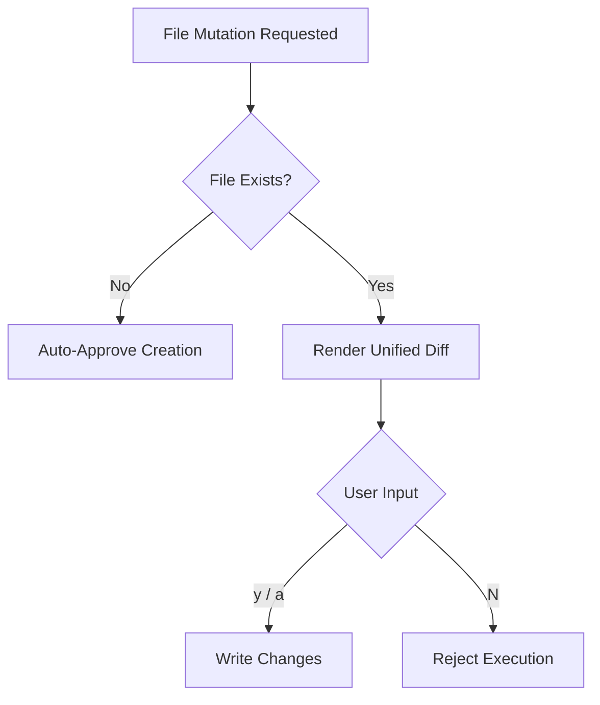
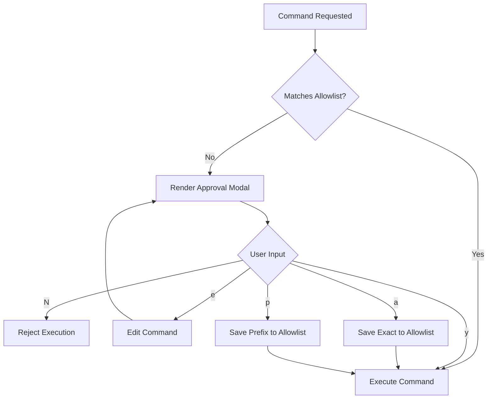
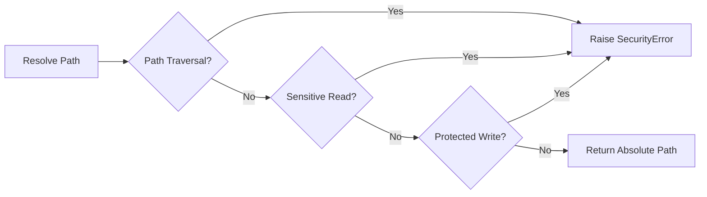

# Approval Boundary

Nightmare maximizes agent autonomy on read operations while enforcing explicit user control on state mutations. This prevents destructive actions while maintaining high velocity for reconnaissance and context gathering.

## File Mutation Approval

New file creations are automatically approved to accelerate bootstrapping. Existing file modifications present an interactive unified diff for review before writing.



```crystal
# Approving a diff programmatically
approval = Nightmare::UI::Approval.new("/workspace")
approved = approval.approve_diff(diff_text, "overwrite src/main.cr")
```

| Option | Description |
|---|---|
| `y` / `a` | Approve the file mutation once. |
| `N` / `Enter` | Reject the file mutation (default). |

## Command Approval

Command execution requires explicit approval unless matched by an allowlist. The modal displays the command, arguments, working directory, and timeout, offering fine-grained persistence options.



| Option | Description |
|---|---|
| `y` | Approve execution once (do not save). |
| `N` | Reject execution (default). |
| `e` | Edit command inline and re-prompt for approval. |
| `a` | Save exact command to allowlist for auto-approval. |
| `p` | Save command prefix (binary + first subcommand) to allowlist. |

## The Allowlist System

The allowlist grants auto-approval to trusted commands. It supports exact matching and prefix matching (binary name or subcommand), scoped to either the current session or persisted globally.

```bash
# Persisted allowlist location (per-workspace)
cat ~/.config/nightmare/workspaces/<workspace-id>/allow
```

```text
# Example allowlist format
prefix:git status
prefix:ls
cat src/main.cr
^npm run build.*
```

| Scope | Type | Behavior |
|---|---|---|
| Session | Exact | Auto-approves exact command string for the lifetime of the process. |
| Session | Prefix | Auto-approves binary or binary+subcommand for the session. |
| Persist | Exact | Persists exact string to workspace `allow` file. |
| Persist | Prefix | Persists prefix (e.g. `prefix:git status`) globally. |

## Metacharacter and Flag Bans

Commands containing shell metacharacters or high-risk flags bypass the allowlist and mandate interactive approval. This prevents command injection and unauthorized subshells.

```crystal
# Commands with these characters will always prompt
Nightmare::Tools::Allowlist::METACHARACTERS = [
  ';', '&', '|', '`', '$', '>', '<', '\n', '\r', '(', ')', '{', '}',
  '\\', '*', '?', '[', ']', '~', '#', '!', '\0', '\e'
]
```

```bash
# This exact string will prompt even if 'echo' is in prefix allowlist
echo "Hello" > output.txt
```

### Denylisted Flags

Specific flags that execute code or manipulate configurations are permanently denylisted. 

| Flag / Pattern | Example | Reason |
|---|---|---|
| `-c`, `-e`, `-E`, `-C` | `bash -c "rm -rf /"` | Inline code execution. |
| `--config`, `--upload-pack`, `--receive-pack` | `git --upload-pack=...` | Configuration override / remote execution. |
| `-exec`, `-execdir`, `-ok`, `-okdir` | `find . -exec rm {} \;` | Sub-command execution via find. |

## Security Guard and Path Resolution

`Nightmare::Tools::Guard` ensures all read and write operations stay within the workspace boundary. It actively prevents path traversal and blocks access to sensitive system or repository files.



```crystal
guard = Nightmare::Tools::Guard.new(env)
safe_path = guard.resolve_write("src/main.cr")
```

### Sensitive Reads

The system blocks read access to patterns matching `.env*`, `*.pem`, `id_rsa*`, `*secret*`, `*credential*`, and `.git`.

### Protected Writes

Writes to `.git` and `.nightmare` directories are unconditionally prohibited. This protects repository integrity and agent configuration.

```bash
# Agent attempt to modify git history
nightmare write .git/HEAD "ref: refs/heads/pwned"
# [Refused: .git/HEAD is a protected path]
```

---
- Previous: [Tools](04-tools.md)
- Next: [Context Engine](06-context-engine.md)
