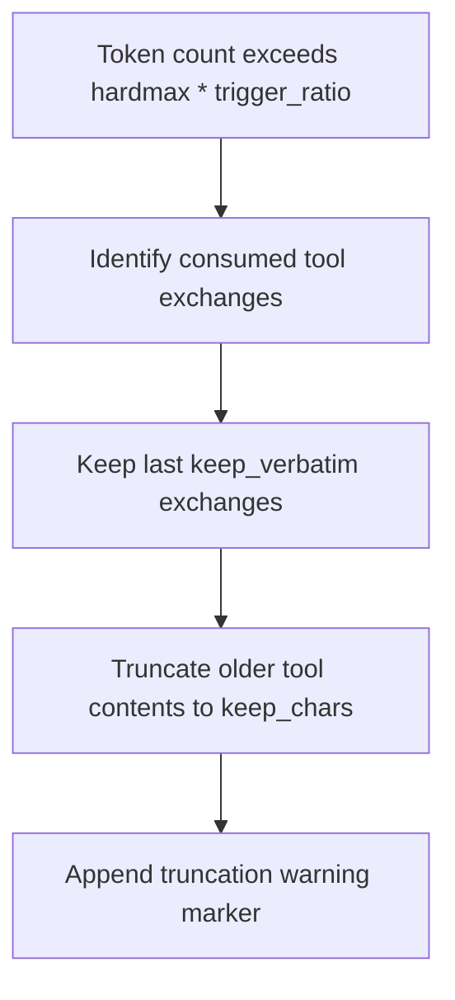

# Context Engine

LLMs have finite context windows. NIGHTMARE manages this transparently by dynamically shedding, compressing, and evicting conversation history to stay within token limits without breaking tool-call integrity.

## Atomic Turn Units

A Turn is the fundamental indivisible unit of context. It contains the initial user prompt, all intermediate tool calls and their results, and the final assistant response. Tool calls and results are strictly paired and never separated during pruning.

```crystal
# Turn message sequence guarantee
[
  Mantle::Message.new(role: "user", content: "..."),
  Mantle::Message.new(role: "assistant", tool_calls: [...]),
  Mantle::Message.new(role: "tool", content: "..."),
  Mantle::Message.new(role: "assistant", content: "...")
]
```

## Sliding Window Storage

NIGHTMARE enforces both a soft cap on turn count and a hard limit on estimated tokens via the `SlidingStore`. Older completed turns are evicted first (FIFO) when limits are exceeded.

```crystal
# Initialize sliding store
store = SlidingStore.new(soft_cap: 10, hardmax: 12000)
store.commit_turn # Pushes active turn, pops oldest if size > 10
```

| Parameter | Type | Default | Description |
|---|---|---|---|
| `soft_cap` | Int32 | `10` | Maximum number of turns retained in history before FIFO eviction. |
| `hardmax` | Int32 | `12000` | Absolute ceiling for total tokens allowed in the context window. |

## In-Turn Shedding

When a single turn grows too large, the system aggressively compresses intermediate tool outputs while preserving the immediate context.



```crystal
# Sheds content exceeding thresholds
exchange.shed!(200) 
# Result: "...content...\n[... output truncated: was 4096 bytes]"
```

| Parameter | Type | Default | Description |
|---|---|---|---|
| `trigger_ratio` | Float64 | `0.85` | Threshold (85% of hardmax) that triggers in-turn shedding. |
| `keep_chars` | Int32 | `200` | Number of characters to retain from a truncated tool result. |
| `keep_verbatim` | Int32 | `2` | Number of recent tool exchanges left entirely uncompressed. |

## Token Calibration

NIGHTMARE estimates token counts using an Exponential Moving Average (EMA) of character-to-token ratios, self-calibrating against the model's reported `prompt_eval_count`. State is persisted to `calibrator.json`.

```json
{
  "divisor": 3.42,
  "last_prompt_tokens": 1500
}
```

| Parameter | Type | Default | Description |
|---|---|---|---|
| `initial_divisor` | Float64 | `3.5` | Starting character-to-token ratio. |
| `divisor_alpha` | Float64 | `0.2` | Smoothing factor for EMA updates. |
| `divisor_clamp_min` | Float64 | `1.0` | Minimum allowable divisor. |
| `divisor_clamp_max` | Float64 | `10.0` | Maximum allowable divisor. |

1. Read model `prompt_eval_count` after completion.
2. Calculate current ratio: `assembled_chars / prompt_eval_count`.
3. Update divisor: `(1 - alpha) * old + (alpha * new)`.
4. Persist to cache directory.

## Context Spend Caps

Prevents infinite loops or run-away token generation within a single turn by enforcing a hard ceiling on compute expenditure.

| Parameter | Type | Default | Description |
|---|---|---|---|
| `TURN_SPEND_CAP_TOKENS` | Int32 | `200000` | Maximum tokens processed before a turn is forcefully aborted. |

## Pinned Files

The `/add` command pins files directly into the system context. Pinned files consume a dedicated subset of the token budget to prevent starving conversational history.

```crystal
# Adding a pinned file
pinned_files.add("config.yml", guard, calibrator, slice_start: 1, slice_end: 50)
```

| Parameter | Type | Default | Description |
|---|---|---|---|
| `budget_ratio` | Float64 | `0.60` | Maximum percentage of `hardmax` allocatable to pinned files. |
| `PER_FILE_MAX_TOKENS` | Int32 | `10000` | Maximum tokens allowed for any single pinned file. |

## Bulk Data Handling

Certain file extensions inherently contain high-volume, low-density data. The context engine forcefully caps their read lengths by default.

```crystal
# config.cr
BULK_DATA_PATTERNS = ["*.jsonl", "*.log", "*.trace", "*.ndjson"]
BULK_DATA_MAX_LINES_DEFAULT = 50
```

| Parameter | Type | Default | Description |
|---|---|---|---|
| `BULK_DATA_PATTERNS` | Array(String) | `["*.jsonl", "*.log", "*.trace", "*.ndjson"]` | Glob patterns matching high-volume bulk data files. |
| `BULK_DATA_MAX_LINES_DEFAULT` | Int32 | `50` | Maximum lines read from bulk data files unless explicitly sliced. |

---

- Previous: [Approval Boundary](05-approval-boundary.md)
- Next: [Execution Pipeline](07-execution-pipeline.md)
