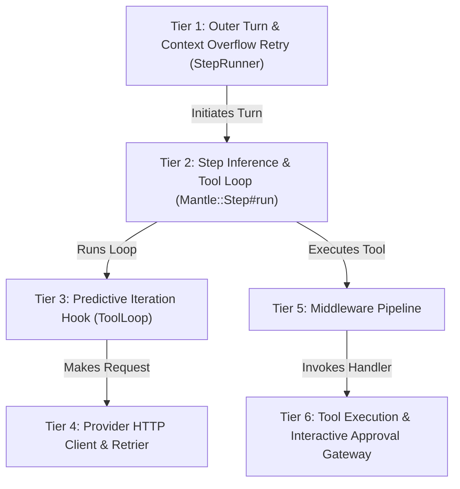

# Execution Pipeline

The Execution Pipeline is a self-healing state machine that coordinates inference steps, tool executions, and context shedding for a single user turn. It recovers from context overflows, malformed output, and rate limits without failing the interaction.

## Architecture



## 6-Tier Loop Hierarchy

1. **Outer Turn (StepRunner)**: Catches `context_overflow` errors, executes emergency shedding, and retries the turn.
2. **Step Inference (Mantle::Step)**: Executes the core tool loop bounded by `MAX_ITERATIONS` (25).
3. **Predictive Iteration Hook**: Synchronizes working messages, recalibrates the token estimator, and executes proactive shedding.
4. **HTTP Client & Retrier**: Handles network requests, streaming, and HTTP 429 rate-limit backoff with `Retry-After`.
5. **Middleware Pipeline**: Sequentially wraps tool executions (`Presentation` → `LoopDetector` → `ExceptionTrapping`).
6. **Tool Execution**: Executes the raw tool handler through the interactive approval gateway.

## Middleware Pipeline

Middlewares implement the `ToolMiddleware::Base` interface to wrap tool handlers. They intercept tool arguments before execution and format return values afterward.

```crystal
class ToolMiddleware::LoopDetector < Base
  def call(
    tool_name : String,
    args : Hash(String, JSON::Any),
    next_handler : Proc(Hash(String, JSON::Any), String)
  ) : String
    refused, msg = @detector.check(tool_name, args.to_json)
    if refused
      msg.not_nil!
    else
      next_handler.call(args)
    end
  end
end
```

## Self-Healing Config

| Parameter | Default | Description |
| --- | --- | --- |
| `MAX_ITERATIONS` | 25 | Maximum consecutive tool calls in a single turn. |
| `FORMAT_RETRIES` | 1 | Intercepts malformed output and injects a hidden correction message. |
| `RATE_LIMIT_RETRIES` | 3 | Maximum HTTP 429 retries using exponential backoff with jitter. |
| `CONTEXT_OVERFLOW_RETRIES` | 1 | Maximum emergency shed attempts upon provider context length rejection. |

### Emergency Context Overflow Recovery

When a provider rejects a payload due to context length, `StepRunner` performs a ruthless, single-pass shed of the active turn.

```crystal
Context::Shedder.shed_active_turn!(
  active,
  current_tokens: store.hardmax + 1000,
  hardmax: store.hardmax,
  trigger_ratio: 0.5,
  keep_chars: 50,
  keep_verbatim: 1,
  calibrator: @tool_loop.calibrator
)
```

### Rate-Limit Backoff

The `Retrier` applies exponential backoff with random jitter for any error marked as `rate_limited?`.

```crystal
# Exponential backoff with random jitter: base * 2^(attempts - 1) + jitter
jitter = Random.rand * 0.2
delay = (0.5 * (2.0 ** (attempts - 1))) + jitter
sleep delay.seconds
```

---
[Previous: Context Engine](06-context-engine.md) | [Next: Plan Orchestrator](08-plan-orchestrator.md)
