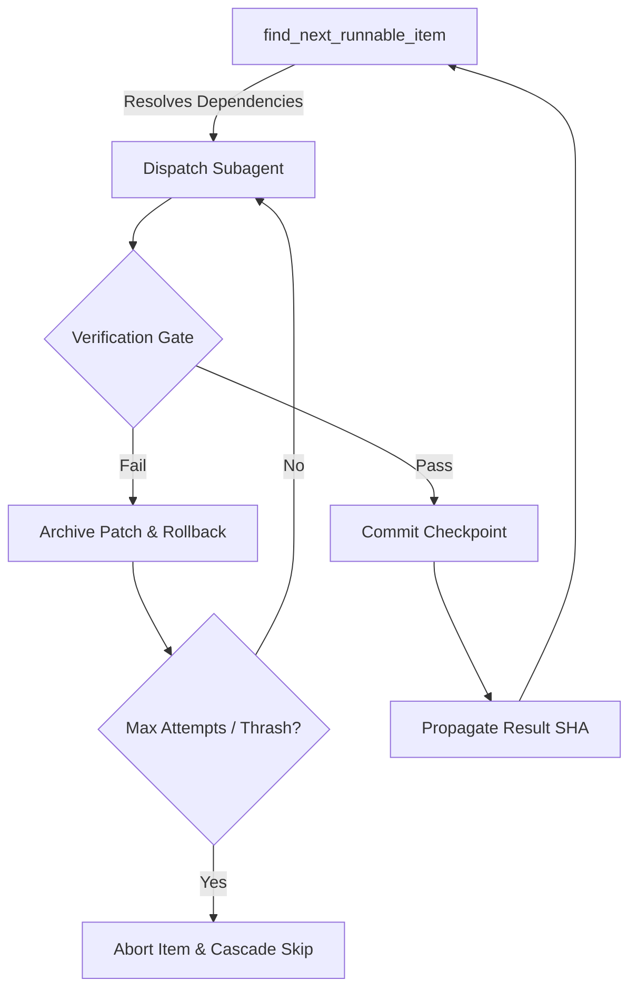
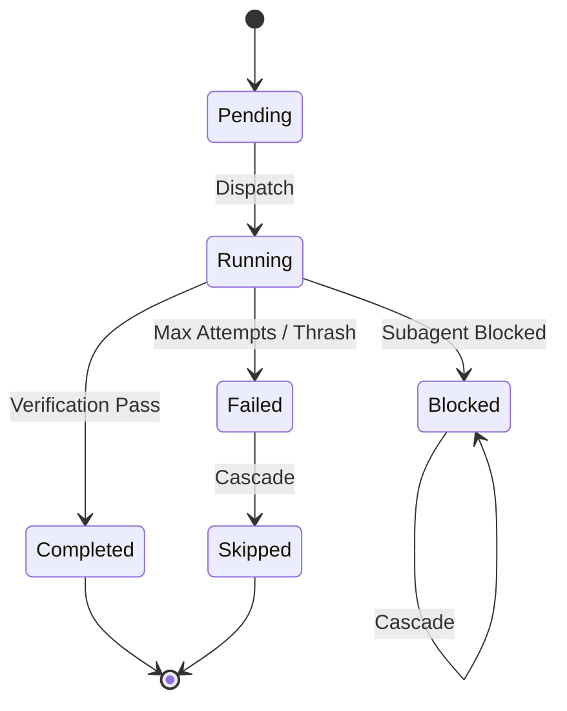

# 08 - Plan Orchestrator

The Plan Orchestrator is a deterministic state machine that executes multi-item work plans in isolated Git worktrees. It guarantees isolation, enforces structural dependency graphs, and gates subagent commits via empirical verification.

## Architecture and Execution Flow



## Plan JSON Schema

A Plan defines the goal, initial state, and a dependency-ordered set of work items.

```json
{
  "id": "refactor-cli-args",
  "goal": "Refactor CLI argument parsing to support --headless flag",
  "schema_version": "1.0.0",
  "base_ref": "main",
  "setup_command": ["shards", "install"],
  "baseline_verification": {
    "command": ["crystal", "spec"],
    "parser": "exit_code",
    "expected_known_failures": []
  },
  "items": [
    // ... PlanItems
  ]
}
```

### Key Parameters

| Field | Type | Default | Description |
|---|---|---|---|
| `id` | String | (Required) | Unique identifier for the plan |
| `goal` | String | (Required) | High-level description of the plan's objective |
| `schema_version` | String | `1.0.0` | Target schema version |
| `base_ref` | String? | `nil` | Branch or SHA to checkout in the isolated worktree |
| `setup_command` | Array(String)? | `nil` | Command run after checkout to prime environment |
| `baseline_verification` | BaselineConfig? | `nil` | Command used to establish pre-run ground truth |
| `max_run_duration_seconds` | Int32 | `14400` | Hard timeout for the entire orchestrator run |
| `max_total_tokens` | Int32 | `500000` | Global token budget across all items |

### Plan Item Schema

Each `PlanItem` represents a discrete unit of work within the plan.

| Field | Type | Default | Description |
|---|---|---|---|
| `id` | String | (Required) | Unique identifier for the item |
| `title` | String | (Required) | Human-readable summary of the work |
| `prompt` | String? | `nil` | Specific instructions injected to the subagent |
| `profile_id` | String | `code_modifier` | Role profile dictating subagent capabilities |
| `depends_on` | Array(String) | `[]` | List of item IDs that must complete first |
| `group_id` | String? | `nil` | Transaction group ID for atomic multi-item commits |
| `files_targeted` | Array(String) | `[]` | Files the subagent is expected to modify |
| `verification` | VerificationConfig | `VerificationKind::None` | Gate determining if the item succeeded |
| `max_attempts` | Int32 | `3` | Maximum retry loops before failing |
| `budget_iterations` | Int32? | `nil` | Token/turn budget allowed for the item |
| `allows_test_removal` | Bool | `false` | Bypasses protections against deleting specs |

## Worktree Provisioning

The orchestrator operates in a sandboxed directory to avoid polluting the user's primary repository.

1. Creates an isolated Git worktree linked to the primary repository.
2. Checks out the `base_ref` (or default branch).
3. Executes the `setup_command` to install dependencies.
4. Executes the `baseline_verification` (if configured) to capture initial state.

## State Machine



## Dependency Propagation

When an item finishes execution, its state impacts downstream items.

1. **Success**: The `result_sha` of the completed item becomes the `base_sha` for its immediate dependents.
2. **Failure**: Dependent items immediately transition to `Skipped`.
3. **Blocked**: Dependent items immediately transition to `Blocked`.

## Verification Gates

The `VerificationEngine` evaluates the post-run state against the captured baseline.

| Kind | Description |
|---|---|
| `None` | Automatically passes (useful for research/read-only tasks). |
| `DiffNonEmpty` | Fails if the subagent produced no file modifications. |
| `Compile` | Fails if the provided compiler command returns a non-zero exit code. |
| `Command` | Runs a custom command and evaluates output against a parser. |

If `diff_empty?` is true and verification is not `None`, the item immediately fails before running the gate.

## Thrash Detection

If a subagent repeatedly makes the same mistake, the item is aborted early to save tokens.

1. Computes `SHA256(diff + normalized_error)`.
2. Normalization strips ANSI escapes, memory addresses, and timestamps.
3. If the signature matches a previous attempt, the item is immediately `Failed`.

## Failure Handling

When a verification gate fails:

1. The current Git diff is archived as a `.patch` file.
2. The worktree is rolled back to the `base_sha`.
3. The thrash signature is computed.
4. If attempts remain and no thrash is detected, the item returns to `Pending` for retry.

## Transaction Groups

Items sharing a `group_id` are evaluated sequentially but committed atomically. 

1. Grouped items accumulate file modifications over a shared Git state.
2. Checkpoints are held in memory until all items in the group reach `Completed`.
3. A single Git commit is created for the entire transaction group representing the aggregated diff.

## Pre-flight Linting

Before executing a plan, the `Linter` validates the JSON payload to prevent runtime failures.

1. **Dependencies**: Checks for unknown IDs and circular dependencies via DFS.
2. **Targets**: Mutator items cannot have an empty `files_targeted` array.
3. **Author/Grader Separation**: Warns if a single item modifies both implementation code and verifying specs.
4. **Git Status**: Ensures the primary repository has no uncommitted changes.

## Pacing Modes

The `Pacer` controls execution speed and manages GPU thermal loads. Modes are set via the `/mode` command.

| Mode | Inter-Item | Inter-Turn | Notes |
|---|---|---|---|
| `sprint` | 0.0s | 0.0s | Maximum throughput. |
| `pace` | 3.0s | 0.5s | (Default) Thermal ceiling trips at 80°C, resumes at 70°C. |
| `step` | 6.0s | 1.0s | Heavily throttled for observation. |

## Slash Commands

Interact with the plan orchestrator directly from the terminal interface.

* `/plan run <file>`: Execute an autonomous plan in an isolated Git worktree.
* `/plan status [id]`: Inspect active or recent plan run state.
* `/plan report [id]`: Generate comprehensive plan report and telemetry.
* `/plan review <file>`: Pre-flight check plan for cycles, targets, and warnings.
* `/mode [mode]`: Set pacing mode (`sprint`, `pace`, `step`).

## Example Plan

```json
{
  "$schema": "https://nightmare.dev/schemas/plan-v1.json",
  "schema_version": "1.0.0",
  "id": "refactor-cli-args",
  "goal": "Refactor CLI argument parsing to support --headless flag and config override",
  "base_ref": "main",
  "setup_command": ["shards", "install"],
  "baseline_verification": {
    "command": ["crystal", "spec"],
    "parser": "exit_code",
    "expected_known_failures": []
  },
  "max_run_duration_seconds": 14400,
  "max_total_tokens": 500000,
  "items": [
    {
      "id": "item-1",
      "title": "Map OptionParser structure in cli.cr",
      "prompt": "Inspect the CLI argument handling and document the flags in comments or structure.",
      "profile_id": "researcher",
      "depends_on": [],
      "files_targeted": ["src/nightmare/cli.cr", "src/nightmare/commands/**"],
      "verification": {
        "kind": "none"
      }
    },
    {
      "id": "item-2",
      "title": "Add headless configuration option to Environment",
      "prompt": "Add headless property to Environment class and ensure defaults are preserved.",
      "profile_id": "code_modifier",
      "depends_on": ["item-1"],
      "group_id": "cli-headless-txn",
      "files_targeted": ["src/nightmare/workspace/environment.cr"],
      "verification": {
        "kind": "compile",
        "command": ["crystal", "build", "--no-codegen", "src/nightmare.cr"]
      },
      "max_attempts": 3,
      "budget_iterations": 10
    }
  ]
}
```

---
- Previous: [Execution Pipeline](07-execution-pipeline.md)
- Next: [Commands](09-commands.md)
