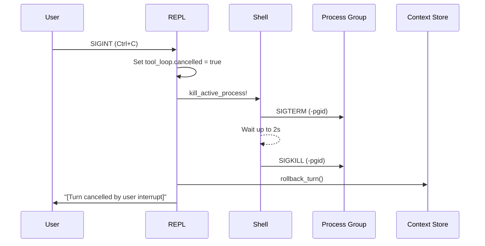

# Signals and Interruption

## Cooperative Cancellation
Pressing `Ctrl+C` while the agent is generating text or executing a tool cancels the active turn. The agent rolls back the context window to its pre-turn state, preserving the session history.



## Process Group Termination
NIGHTMARE executes shell tools in isolated process groups using `setsid`. When interrupted, it applies a termination ladder to prevent orphaned descendant processes.

| Step | Action | Purpose |
|---|---|---|
| 1 | `SIGTERM` | Sent to `-pgid` to request graceful shutdown of the process tree. |
| 2 | Grace Period | System waits up to `PROCESS_GRACE_PERIOD` (2 seconds) for processes to exit. |
| 3 | `SIGKILL` | Sent to `-pgid` to forcefully terminate descendants ignoring the signal. |

```crystal
# src/nightmare/tools/shell.cr
LibC.kill(-pgid.to_i32, Signal::TERM.value)
sleep Config::PROCESS_GRACE_PERIOD
LibC.kill(-pgid.to_i32, Signal::KILL.value)
```

## Side-Effect Tracking
Tools record state mutations (like file edits) as they happen. If you cancel a turn after a file is modified, the file system changes remain, but the agent's context rolls back. The next turn is automatically prefixed with a system notification to reconcile the drift.

```bash
> write an install script
# [Agent edits install.sh, you press Ctrl+C]
[Interrupt received; cancelling active turn...]
[Turn cancelled by user interrupt]

> run it
# Internally, your prompt is rewritten as:
# [Previous turn was interrupted after modifying: install.sh]
# run it
```

## Idle Prompt Interruption
Pressing `Ctrl+C` while at an empty prompt clears the STDIN buffer rather than exiting immediately. A second press within 1.5 seconds terminates the application.

1. Press `Ctrl+C`.
2. STDIN flushes and prints `(Press Ctrl+C again to exit, or type /exit)`.
3. Press `Ctrl+C` again within 1.5s to exit with code `0`.

```crystal
# src/nightmare/ui/cancellation.cr
now = Time.instant
if (last = @last_sigint_at) && (now - last) < 1.5.seconds
  puts "\nExiting."
  exit(0)
end
```

***
* Previous: [Commands](09-commands.md)
* Next: [Observability](11-observability.md)
