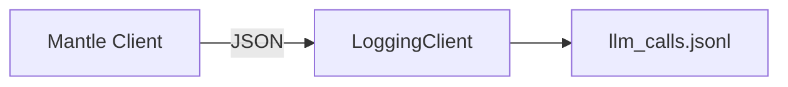

# 11. Observability & Logging

Nightmare provides session observability through transcript recordings and raw API audit logs. 

## Audit Log
The audit log records every raw interaction between Nightmare and the LLM API as JSON Lines. It provides full transparency into the model's raw prompts and completions.



### Log Location & Format
The audit log is located in the workspace state directory: `~/.local/state/nightmare/workspaces/<workspace-id>/llm_calls.jsonl`. 

Each line is a JSON object containing the following keys:

| Field | Type | Description |
| --- | --- | --- |
| `timestamp` | String | ISO-8601 timestamp of the request |
| `model` | String | Model used for completion |
| `prompt` | String | Raw system, context, and user prompt |
| `completion` | String | The model's raw completion output |
| `latency_ms` | Integer | Total request latency in milliseconds |
| `error` | String | Error message if request failed |

### Log Rotation
Audit logs are automatically rotated when they exceed `AUDIT_LOG_MAX_BYTES` (20 MB). Up to 3 historical archives are retained (`llm_calls.jsonl.1`, `.2`, `.3`).

## Session Transcript
The session transcript records a pristine, un-truncated, user-readable Markdown record of your conversation.

### Location
Written incrementally to the workspace state directory: `~/.local/state/nightmare/workspaces/<workspace-id>/transcript.md`.

### Transcript Export
You can export the full in-memory transcript at any time using the `/save` command. This writes the un-truncated record to your specified path.

```bash
/save /path/to/export.md
```

1. Enter `/save [path]` in the REPL.
2. Nightmare copies the current in-memory transcript to the target path.

## Ghost Mode
Ghost mode disables all disk writing for telemetry, logging, and transcripts, running Nightmare entirely in RAM.

### Usage
Start Nightmare with the `--no-log` (or `--no-logs`) flag:

```bash
nightmare --no-log
```

1. Starts with zero disk footprint (no LLM logs, no `transcript.md`).
2. Keeps all session data in RAM only.
3. `/save` remains functional, allowing you to selectively export the RAM transcript before exiting.

### Permanent Disabling
You can permanently disable logging across all sessions by updating your settings.

```json
{
  "logging": false
}
```

1. Open your workspace or global `config.json` (`~/.config/nightmare/config.json`).
2. Set `"logging"` to `false`.

---
- Previous: [Signals & Interruption](10-signals-and-interruption.md)
- Next: [Settings Reference](12-settings-reference.md)
