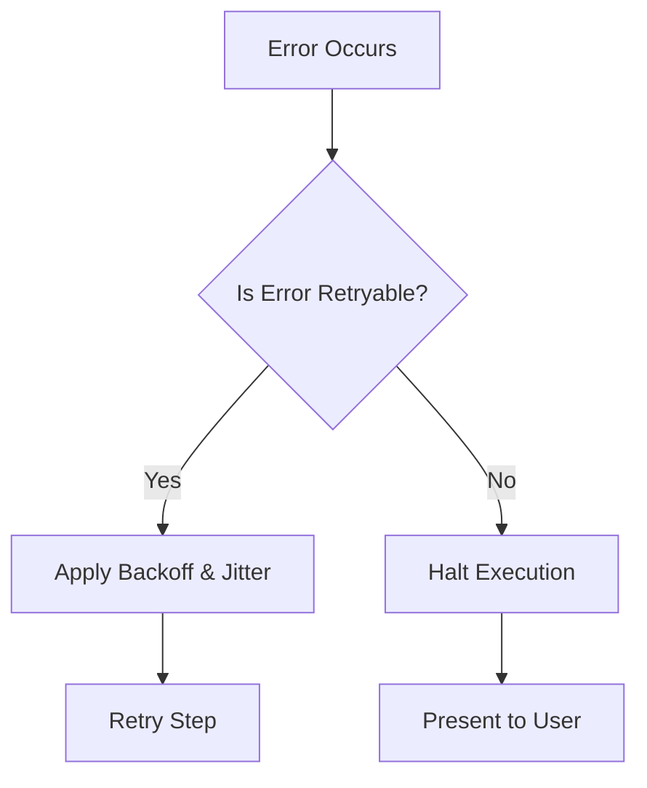

# 13. Troubleshooting

Nightmare is designed to handle transient failures gracefully, but some errors require manual intervention.

## Error Resolution Lifecycle

## Common Errors & FAQs

### Q: Error 404: model not found
**Cause**: The configured model has not been pulled in Ollama.
**Resolution**:
1. Run `ollama list` to view available local models.
2. Run `ollama pull <model-name>` to download the required model.

### Q: Path traversal violation or SecurityError
**Cause**: A tool operation attempted to read or write files outside the workspace root directory.
**Resolution**:
1. Ensure all file paths in prompts are relative to the workspace or explicitly within the project directory.
2. If temporary files are needed, instruct the model to use the designated scratch directory.

### Q: Connection refused 127.0.0.1:11434
**Cause**: The Ollama daemon is not running on the default local port.
**Resolution**:
1. Start the Ollama server by running `ollama serve`.
2. Verify the server is running by visiting `http://localhost:11434` in a browser.

### Q: How to permanently change default model?
**Cause**: You want to use a model other than the default `qwen2.5-coder:7b` across all sessions.
**Resolution**:
1. Open your configuration file at `~/.config/nightmare/config.json`.
2. Set the `model` key to your preferred model name.

### Q: Context length exceeded (ContextOverflow)
**Cause**: The conversation history has grown too long and exceeded the model's context window.
**Resolution**:
1. Type `/clear` to reset the conversation history.
2. Note that Nightmare attempts auto-recovery via context shedding, but this error occurs if shedding fails to free enough space.

### Q: Spend cap exceeded (SpendCapExceeded)
**Cause**: A single turn used more than 200,000 tokens, hitting the `TURN_SPEND_CAP_TOKENS` limit.
**Resolution**:
1. Break your request into smaller, sequential steps.
2. Instruct the model to use subagents for parallel or complex tasks.

### Q: Plan item thrash detected
**Cause**: The agent is caught in a loop, applying the same diff and receiving the same error repeatedly (triggers after 3 attempts).
**Resolution**:
1. Abort the current run.
2. Refine the plan item prompt to provide clearer instructions or missing context.

### Q: Max iterations reached (MaxIterationsReached)
**Cause**: The model made 25 consecutive tool calls without completing the task or returning a final answer.
**Resolution**:
1. Break down the task into smaller sub-tasks.
2. Ensure the prompt clearly defines the completion criteria.

### Q: How to run in zero-footprint mode?
**Cause**: You want to prevent Nightmare from writing audit logs or persisting history.
**Resolution**:
1. Launch Nightmare with the `--no-logs` flag.

### Q: How to change the theme?
**Cause**: You want to switch from the default `cyberpunk` theme.
**Resolution**:
1. Type `/theme <name>` during an active session.
2. Or, set the `theme` key in `~/.config/nightmare/config.json` for persistence.

### Q: RateLimited
**Cause**: The model provider returned an HTTP 429 error.
**Resolution**:
1. Wait; Nightmare automatically applies backoff and jitter.
2. If using a cloud provider, check your quota limits.

### Q: ExecutionTimeout
**Cause**: A tool or shell command exceeded its allowed time (default 60s, max 600s).
**Resolution**:
1. Run long-running commands as background tasks or daemons.
2. Avoid commands that require interactive user input.

### Q: MalformedOutput
**Cause**: The model returned unparseable or empty completion data.
**Resolution**:
1. Nightmare will automatically retry formatting.
2. If it persists, the model may be degraded. Try switching models.

---
- Previous: [Settings Reference](12-settings-reference.md)
- Next: none
